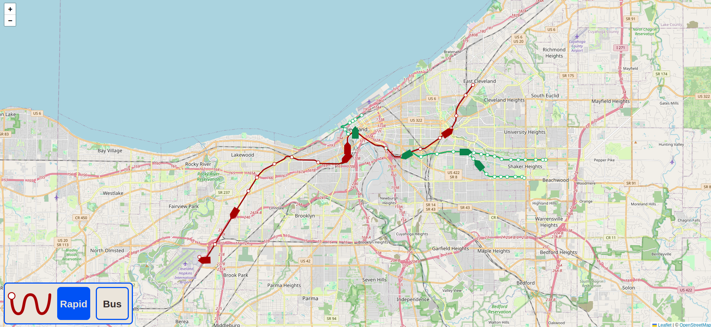

# wheresrta  

<p align="center">

</p>

wheresrta.net uses the GTFS-RT data provided by Cleveland's RTA to track the real time location of Cleveland transit.  

## Running  

### Setup  

To install the required gems and start the server do:  
```bash
bundle install
bin.rails db:migrate
bin/rails server
```  

### Updating database:  
To update the database with the current location do:  
```bash
rake update_transit:update
```
I have this set to a 2 minute cron job (I notice rate limiting when I attempt 1 minute)  

## Example:

<p align="center">

</p>
